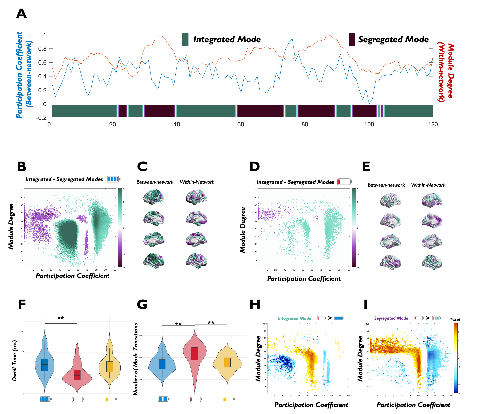

# Reference
N. Cross, F. Borgetto, M. Uji, A. Jegou, A. Nguyen, K. Lee, U. Aydin, A. Perrault, C. Grova, T.T. Dang-Vu (2025). Sleep deprivation constrains dynamic configurations of integrated and segregated brain states impacting cognitive performance.
bioRxiv 2025.10.21.683658; doi: https://doi.org/10.1101/2025.10.21.683658

# Background
The breakdown of cognitive control following sleep deprivation is widely recognised, but the physiological mechanisms and brain signatures that produce this vulnerability have not been resolved. Effective cognition relies on large-scale brain networks flexibly reconfiguring between states of integration and segregation. Here we combined functional magnetic resonance imaging (fMRI), electroencephalography (EEG), and electrocardiography (ECG) collected during cognitive tasks under rested wakefulness, after sleep deprivation, and following a recovery nap to test the hypothesis that sleep deprivation constrains this dynamical repertoire and disrupts its physiological regulation. Using time-resolved functional connectivity and graph theory, we show that sleep deprivation increases the distribution of connections across networks, while reducing the temporal variability of between-network connectivity. Furthermore, dynamic fluctuations between integrated and segregated modes of network topology were dampened, with brain regions spending more time in intermediate configurations and showing greater instability of mode transitions. These alterations were tightly linked to behavioural impairment: participants who exhibited greater contraction toward intermediate topologies also showed poorer task accuracy and slower responses. Under well-rested conditions, thalamic activity peaked prior to transitions into integrated states and was suppressed during transitions into segregated states, consistent with a coordinating role in cortical dynamics. Sleep deprivation weakened and delayed this thalamic coupling. Finally, global and regional fMRI fluctuations were elevated after sleep loss, becoming decoupled from cardiac physiology while more strongly coupled to EEG delta power, further linking reduced arousal to constrained network flexibility. Together, these findings show that sleep deprivation narrows the brain’s dynamical repertoire, due to disrupted thalamic regulation and changes to the physiological integration with cortical networks.

Figure 2.
Fluctuations between integrated and segregated brain modes are dampened after sleep deprivation.
A| Dynamic fluctuations in within- and between-network connectivity for a representative subject. Blue line reflects participation coefficient (BT), red line reflects within-module degree (WT), and overlaid state labels indicate transitions between integrated (green) and segregated (purple) brain modes determined by k-means clustering (k=2) of the cartographic profile. B| Group-level cartographic profiles, showing the differences in joint distribution of WT and BT values between integrated and segregated modes in the Well Rested (left) and Sleep Deprived conditions (right). Colour intensity indicates the frequency of regions occupying each topological state (Green = higher during integrated modes, Purple = higher during segregated modes, coloured points pFDR<0.05). C| Mean dwell time spent in each integrated and segregated modes and the number of transitions between modes across conditions represented. Bars show mean ± SEM across participants. D| Group-level cartographic profiles, showing the differences in joint distribution of WT and BT values between the Well Rested and Sleep Deprived conditions during integrated (left) and segregated (right) modes (Yellow = higher during Sleep Deprivation, Blue = higher during Well Rested condition, coloured points pFDR<0.05).
