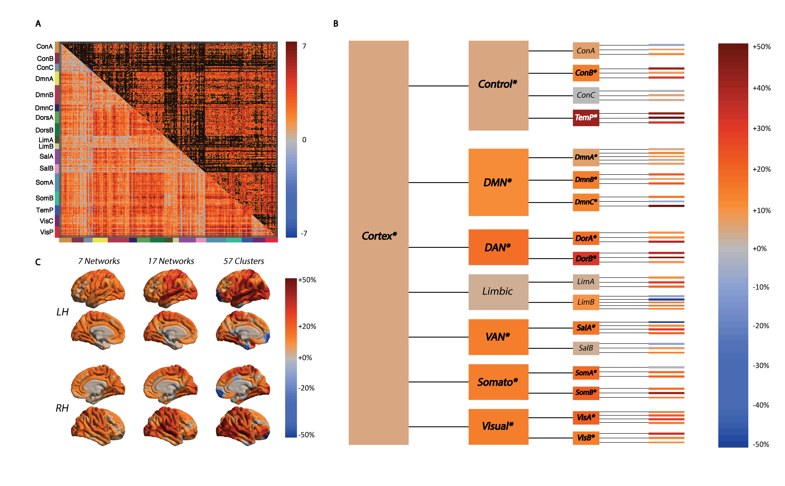

# Reference
1.	Cross N, Pomares FB, Nguyen A, Perrault AA, Jegou A, Uji M, Lee K, Razavipour F, Ali OBK, Aydin U, Benali H, Grova C, Dang-Vu TT. (2020). An altered balance of integrated and segregated brain activity is a marker of cognitive deficits following sleep deprivation. (Accepted, PLoS Biology) - bioRxiv; https://doi.org/10.1101/2020.11.28.402305.

# Background
Sleep deprivation (SD) leads to impairments in cognitive function. Here, we tested the hypothesis that cognitive changes in the sleep-deprived brain can be explained by information processing within and between large-scale cortical networks. We acquired functional magnetic resonance imaging (fMRI) scans of 20 healthy volunteers during attention and executive tasks following a regular night of sleep, a night of sleep deprivation, and a recovery nap containing non-rapid eye movement (NREM) sleep. Overall, sleep deprivation was associated with increased cortex-wide functional integration, driven by a rise of integration within cortical networks. The ratio of within vs between network integration in the cortex increased further in the recovery nap, suggesting that prolonged wakefulness drives the cortex toward a state resembling sleep. This balance of integration and segregation in the sleep-deprived state was tightly associated with deficits in cognitive performance. This was a distinct and better marker of cognitive impairment than conventional indicators of homeostatic sleep pressure, as well as the pronounced thalamo-cortical connectivity changes that occurs towards falling asleep. Importantly, restoration of the balance between segregation and integration of cortical activity was also related to performance recovery after the nap, demonstrating a bi-directional effect. These results demonstrate that intra- and inter-individual differences in cortical network integration and segregation during task performance may play a critical role in vulnerability to cognitive impairment in the sleep deprived state.

Fig 1. (A) The t-test matrix of change in functional correlations between the timeseries of 400 cortical parcels (during task performance) depicts a widespread increase in correlations between sleep deprivation (SD) and well rested (WR) states (unthresholded, lower triangle; thresholded PFDR<0.05, upper triangle). (B) Changes in integration (as a percentage of the value in the WR condition) are shown across different levels of a hierarchical model of the cortex: whole cortex, 7 networks, 17 networks, and 57 clusters. The total integration within the cortex increased from the WR to the SD state, but not within all networks (*italics depict significant changes measured through a Bayesian framework). (C) The % change in total integration at each level of the hierarchy mapped onto the cortical surface illustrates the increase in integration is most focused toward the centre of the lateral surface. DMN = Default Mode Network; DAN = Dorsal Attention Network; VAN = Ventral Attention (Salience) Network; Somato = Somatomotor Network!
