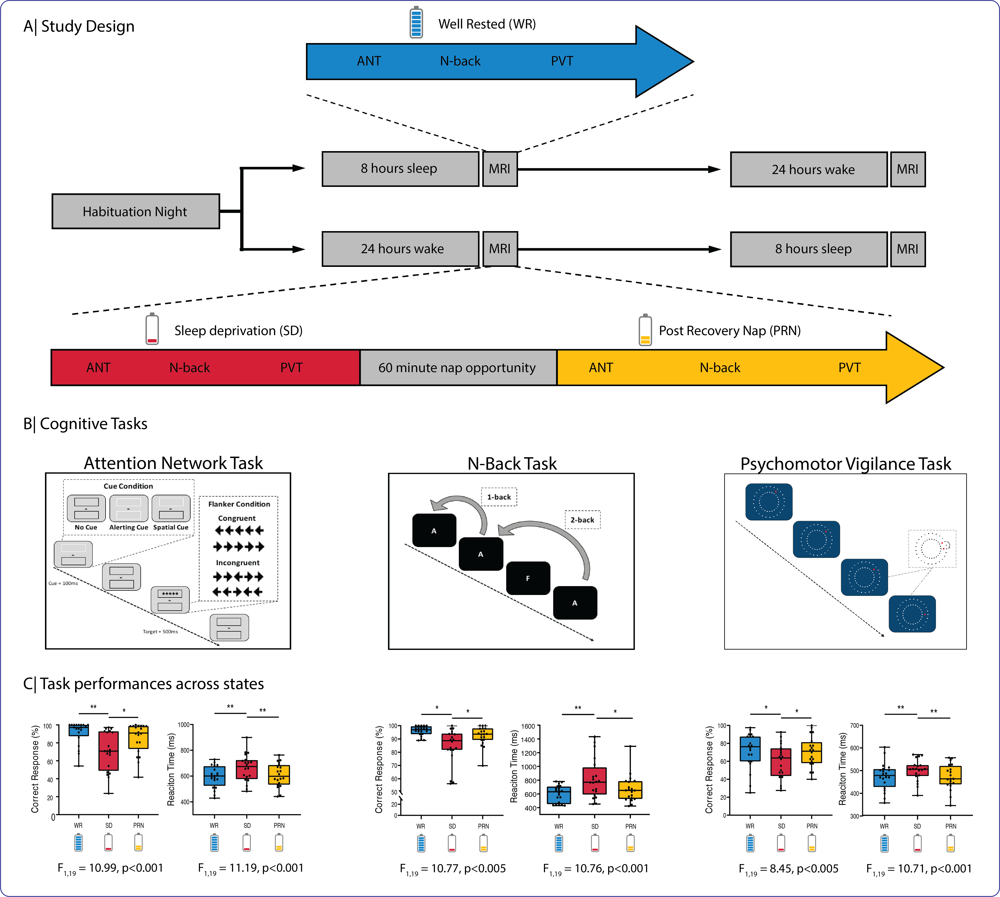

# About

These projects relate to multimodal neuroimaging (EEG,fMRI) during cognitive tasks, following total sleep deprivation performed on 20 young, healthy adults at the PERFORM Centre, Montreal, Canada.

